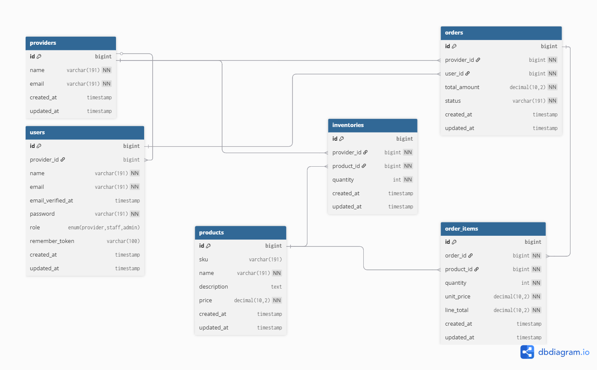

### High-Level System Overview
This system manages interactions between providers, products, and orders. Providers (Surgeon or Staff) can add and manage their product listings. Orders track which provider is associated with which product and include details such as quantity, price, and status. 
The system maintains inventory levels, ensuring products are updated as orders are placed. 
Relationships between entities, such as providers, products, and orders, are captured in the database to maintain data integrity. 
Notifications and reporting can be generated based on order and provider activity. Overall, the system is designed to streamline product management, provider operations, and order tracking efficiently.